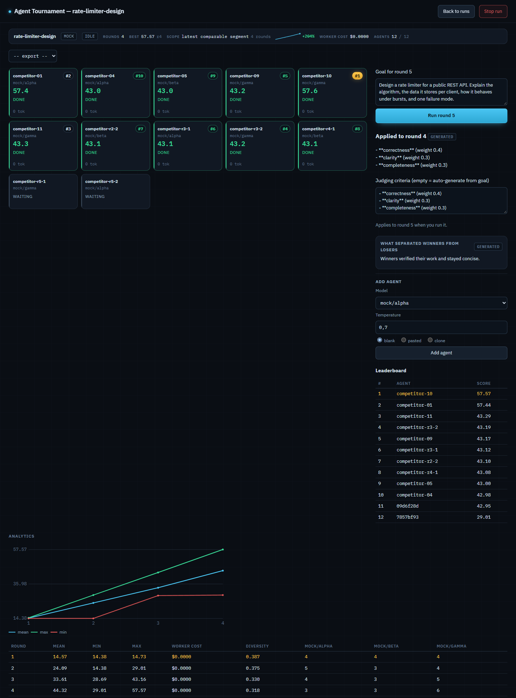
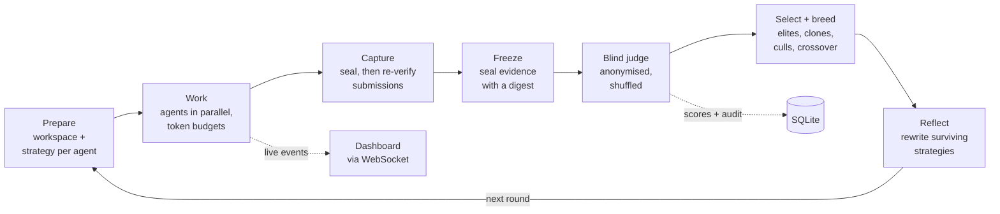

# Agent Tournament

[](https://github.com/BestMiraPro/Agent-tournament/actions/workflows/ci.yml)

A local-first TypeScript platform that runs a population of LLM agents on the same task, grades their work blindly, and evolves their strategies across rounds through selection, cloning, mutation and recombination. Every score can be traced back to the evidence the grader was shown.

It runs fully offline on deterministic mocks. It can also drive real tool-using agents through [OpenCode](https://opencode.ai), either on the host or in Docker containers that are resource-capped, network-restricted and hold no provider credentials.



<sub>The dashboard after a 4-round, 12-agent run in <b>mock mode</b> (no credentials, no model calls). Scores come from the deterministic mock judge. They demonstrate the UI and the evolution loop, not real-model performance.</sub>

## Why this is harder than "run N agents and keep the best one"

- **The grader is the fitness function.** Selection amplifies whatever the judge rewards. If the judge can be biased by position, shown a different artifact than the one produced, or steered by a submission, the tournament evolves toward that flaw.
- **Agents run arbitrary shell commands and are selected on outcome.** A strategy that forks endlessly, fills the disk, reads a rival's workspace or finds a credential can be *selected for*. Resource limits and isolation are part of the design, not an afterthought.
- **Rounds are concurrent, long-running and partially failing.** Remote sessions time out, hang, or lose their response channel. The engine has to tell "the request returned" apart from "the agent stopped", recover after a restart, and never breed from or bill for work it did not judge.
- **Results should be reproducible and inspectable.** Seeded RNG, mocks that exercise the same orchestration path as real runs, and persisted runs that can be compared, exported and rejudged.

## How a round works



Each agent's strategy (a markdown "genome" plus model and temperature) is the unit of evolution. Agents work in their own workspace and write a `SUBMISSION.md`. After judging, the top band is cloned, the bottom band is culled, elites carry over unchanged, crossover children combine two parents, and a diversity floor rescues the most distinct culled strategy. Reflection then rewrites each survivor's strategy using what separated winners from losers. Lineage is kept for every agent, including retired ones.

The engine does not know which runtime it is driving. Mock, local and Docker sandboxes sit behind one `Sandbox` interface and the judge and reflector behind one `Provider` interface, so the orchestration logic is tested deterministically without external services. More detail: [docs/architecture.md](docs/architecture.md).

## Evaluation design

- **Blind, shuffled judging.** The judge sees anonymous references (`S1`, `S2`, …), not agent IDs, models or lineage. The shuffle is seeded per round. An earlier version reused one permutation for every round, which turned the judge's position bias into a permanent fitness bonus for the same agents.
- **The captured artifact is what gets judged.** Output is captured the moment each agent stops, then checked again once no agent in the round is running. A file changed in between is recorded as tampering, and the judge sees the captured copy, not a fresh read that a rival could have overwritten.
- **Evidence is frozen before grading.** Behavioural evidence (tool calls, file and permission events, failures, coverage gaps) is reduced to allowlisted metadata, redacted, persisted, and sealed with a digest at the judging boundary. Events that arrive later are kept as "late" and cannot change the set a score was based on.
- **Scores come with a decision record.** Each score stores the criteria actually used, per-criterion assessment, cited evidence (checked against what that submission was shown), stated limitations, the evaluator model and the prompt version. A behavioural safety review is kept separate from the score. Model output is treated as untrusted and validated with schemas.
- **Rejudging is non-destructive.** A completed round can be regraded with another judge model without overwriting the original result.

## Execution modes and isolation

| Mode | Where agents run | Provider credentials | Network | Intended for |
|---|---|---|---|---|
| `mock` | In-process, no real agents | None needed | None | Development, tests, demos |
| `local` | OpenCode sessions on the host | Host OpenCode config | Host network | Trusted tasks only. **No isolation.** |
| `docker`, `shared` isolation | Resource-capped containers, possibly several agents per container | `auth.json` mounted read-only | Ordinary | Runs the relay cannot carry |
| `docker`, `protected` isolation | One container per agent | **None inside the container** | Internal Docker network only | Untrusted agent code |

In **protected** mode, each worker container is started with `--cap-drop ALL`, `no-new-privileges`, a read-only root filesystem, a fixed unprivileged user, memory/CPU/PID/file-size limits with swap disabled, and a writable `/work` plus bounded tmpfs. It joins only a per-agent `--internal` Docker network. Its only way out is a small gateway container that forwards two fixed routes. Model calls go through a host-side relay that swaps a per-run token for the real key. The relay accepts only model-call endpoints for models in the run's roster, within a per-agent request limit, and stops serving a run as soon as the run is stopped. Code: [`src/runtime/docker/cli.ts`](src/runtime/docker/cli.ts), [`gateway.ts`](src/runtime/docker/gateway.ts), [`provider-relay.ts`](src/runtime/provider-relay.ts).

Protected is the default for Docker runs created from the dashboard. The CLI's Docker mode keeps `shared` unless configured otherwise. An opt-in end-to-end suite (`ARENA_DOCKER_E2E=1`, [`test/e2e/container-policy.test.ts`](test/e2e/container-policy.test.ts)) starts real protected containers with fake credentials and a fake provider, and checks these boundaries from inside them.

**What this does not claim:** a worker can still use the model access it was granted. Container isolation is only as strong as Docker on the host. Secret redaction in captured activity is pattern-based defence in depth, not a guarantee. Activity capture sees each tool call's own summary, not every subprocess a command starts.

## Quick start (no API keys)

Requires **Node.js 24** (the persistence layer uses the built-in `node:sqlite`).

```bash
git clone https://github.com/BestMiraPro/Agent-tournament.git
cd Agent-tournament
npm ci
npm run tournament -- --mode mock --rounds 2 --population 4 --goal "Write one clear sentence defining what a tournament is."
```

Mock mode is deterministic and makes no network or model calls. It prints each round's mean and best score and the winning strategy.

To use the dashboard:

```bash
npm start
```

This builds the UI, starts the API and WebSocket server on `http://127.0.0.1:4300`, and opens the browser. Choose **Create run**, leave the sandbox on `mock`, and start rounds. Mock runs need no further setup.

Real-agent and Docker modes need OpenCode and provider credentials. See the [operator guide](docs/operator-guide.md).

## Tests and quality gates

CI runs the same three gates on every push to `master` and on every pull request ([workflow](.github/workflows/ci.yml)):

```bash
npm test            # Vitest
npm run typecheck   # tsc --noEmit, strict mode with noUncheckedIndexedAccess
npm run web:build   # Vite production build of the dashboard
```

The suite has **1,416 test cases in 112 files**. Some are platform-specific or opt-in, so the pass/skip split depends on where it runs (measured 21 September 2026):

| Environment | Passed | Skipped |
|---|---|---|
| Linux (Node 24, as in CI) | 1,401 | 15 |
| Windows 11 (Node 24) | 1,397 | 19 |

The skipped cases are:
- Four opt-in end-to-end suites that need real services: a real provider (`ARENA_E2E=1`), Docker (`ARENA_DOCKER_E2E=1`), the real dashboard (`ARENA_DASHBOARD_E2E=1`), and the protected-container policy check (also `ARENA_DOCKER_E2E=1`).
- Process-termination tests for the other OS.
- On Windows without symlink privileges, file-symlink escape tests.

Coverage includes the engine and selection logic, judge parsing and anonymisation, the provider relay's allow/deny decisions, Docker argument construction, workspace path-escape and symlink attacks, SQLite migrations and restart recovery, the HTTP/WebSocket API, and the dashboard's pure state reducers.

## Repository layout

```text
src/
  core/        domain types, seeded RNG, selection, analytics, redaction
  engine/      round driver, budgets, submission capture, evidence audit, events
  evolution/   cloning, mutation (reflection), recombination
  judge/       blind judging, criteria, schemas, grading audit
  runtime/     sandbox + provider interfaces; mock, local, Docker and OpenCode implementations; provider relay
  db/          node:sqlite schema, migrations, repositories, restart recovery
  server/      Fastify API, run manager, WebSocket bridge, export
  cli.ts       headless tournament runner
web/src/       React 19 dashboard (live grid, lineage, analytics, run comparison, rejudge)
test/          unit, integration and opt-in end-to-end tests
docker/        research-agent image and pinned, hash-locked Python toolchain
docs/          architecture, operator guide, API reference, design history
```

## Why I built this

Most multi-agent demos stop at orchestration: start several agents, collect the answers, pick one. I wanted to know whether improvement across generations could be *measured*. That meant the parts usually treated as incidental, like the judge, the evidence, the budget and the execution boundary, had to be engineered carefully enough to trust the measurement. Most of the work in this repository is in those parts.

## Status and limitations

This is an active personal research and engineering project, not a hosted product.

- **Single host, local-first.** The dashboard binds to `127.0.0.1` and has no authentication. It is not meant to be exposed on a network.
- **Cost accounting covers worker agents.** Judge, reflection and recombination calls are not yet counted in the per-run budget, because the provider interface returns text rather than a usage envelope.
- **`local` mode has no isolation**, and `shared` Docker mode trades isolation for compatibility (see the table above).
- **Mock scores are synthetic.** They come from a keyword-based mock judge and exist to exercise the pipeline. No real-model benchmark results are published here.
- **Real-mode behaviour depends on OpenCode and the provider.** The agent image pins OpenCode `1.18.21`. Real runs cost money and are not exercised in CI.
- Developed mainly on Windows. CI runs on Ubuntu. macOS has not been tested.

## Documentation

- [Architecture](docs/architecture.md): components, round lifecycle, data model
- [Operator guide](docs/operator-guide.md): real and Docker modes, isolation, CLI flags, sizing
- [API reference](docs/api-reference.md): REST and WebSocket endpoints
- [Design history](docs/README.md): per-phase design specs, implementation plans and review records
