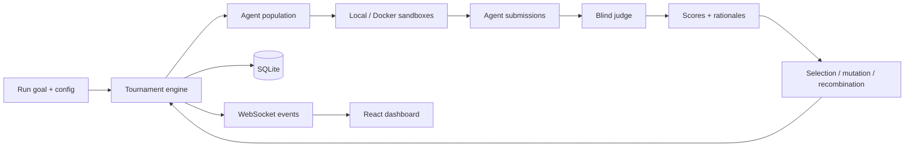

# Agent Tournament

A local-first platform for running large populations of LLM agents against the same problem, judging them blindly, evolving the strongest approaches across rounds, and inspecting the entire process live.

It is built as an experiment in **agent evaluation, selection, reproducibility, and safe execution** rather than as a prompt-demo. The system can run entirely on deterministic mocks, or drive real tool-using agents locally / in Docker.

## Why I built it

Most multi-agent systems stop at orchestration: launch several agents, collect answers, pick one.

Agent Tournament asks a harder question:

> Can we make improvement measurable across generations while keeping the evaluation process auditable and the execution boundary safe?

The project therefore treats judging, lineage, isolation, evidence capture, budget accounting, and reproducibility as first-class engineering problems.

## What it does

- Runs populations of agents in parallel across multiple rounds.
- Uses blind LLM judging with explicit criteria and preserved rationales.
- Selects, clones, mutates, and recombines strategies between rounds.
- Tracks lineage, scores, token usage, cost, model mix, and activity evidence.
- Supports deterministic mock mode for zero-cost local testing.
- Supports real agents through OpenCode.
- Supports protected Docker execution with per-agent isolation.
- Streams live progress to a React dashboard over WebSockets.
- Persists complete runs in SQLite for later comparison and export.
- Redacts secrets from captured activity and seals judging evidence before scoring.

## Architecture



The core engine is separated from the execution and model layers. Mock, local, and Docker runtimes sit behind the same interfaces, so the tournament loop can be tested deterministically without external services.

## Safety boundary

Protected Docker mode is designed so worker agents do not receive provider credentials and cannot access the host or other agents' workspaces.

Each protected worker gets:

- its own resource-capped container;
- a writable workspace and read-only reference/tool mounts;
- no provider key inside the container;
- no ordinary outbound network access;
- model access only through a constrained relay/gateway;
- an unprivileged runtime user and read-only system filesystem.

The project also records agent activity for auditability. Secrets in captured tool output are redacted before storage, and judging uses a sealed evidence snapshot so later activity cannot retroactively change what the judge saw.

## Dashboard

The dashboard is an operator view for the full experiment:

- create and configure runs;
- watch agents work live;
- inspect submissions, lineage, and model usage;
- review judge rationales and behavioural evidence;
- rejudge a completed round non-destructively;
- compare two runs;
- export complete run data as JSON / CSV.

## Quick start — no API keys

Requires Node.js 24.

```bash
npm install

npm run tournament -- \
  --goal "Write a single clear sentence defining what a tournament is." \
  --rounds 2 \
  --population 4 \
  --mode mock
```

Mock mode is deterministic and makes no external model calls.

To launch the dashboard:

```bash
npm start
```

Then open `http://127.0.0.1:4300`.

For real-agent and Docker modes, see [docs/operator-guide.md](docs/operator-guide.md).

## Engineering quality

The repository uses strict TypeScript with `noUncheckedIndexedAccess`, deterministic mocks, integration tests, runtime-boundary tests, and platform-aware end-to-end coverage.

Current suite size: **1,400+ automated test cases** (the exact pass/skip split varies by operating system and optional real-service gates).

Run the main quality gates with:

```bash
npm test
npm run typecheck
npm run web:build
```

## Repository layout

```text
src/
  core/        domain types, RNG, selection, analytics, genomes
  engine/      tournament driver, budgets, events, activity capture
  evolution/   cloning, mutation, recombination, reflection
  judge/       judging prompts, schemas, parsing
  runtime/     mock, local, Docker and OpenCode execution
  db/          SQLite schema, migrations and repositories
  server/      Fastify API, run manager, WebSocket event bridge

web/src/       React dashboard
test/          unit, integration and end-to-end coverage
docker/        protected research-agent image and toolchain
docs/          architecture, API and operator documentation
```

## Design principles

1. **Deterministic code owns orchestration state.**
2. **Evaluation evidence should be inspectable, not implicit.**
3. **Improvement across rounds should be measurable.**
4. **Real-agent execution should not weaken the host security boundary.**
5. **Mocks must exercise the same orchestration path as real runs.**
6. **Reproducibility and failure modes matter more than a polished demo.**

## Status

This is an active research / engineering project. Mock mode is the easiest way to inspect the system without credentials or model cost. Real-mode behaviour depends on the configured provider and OpenCode environment.
